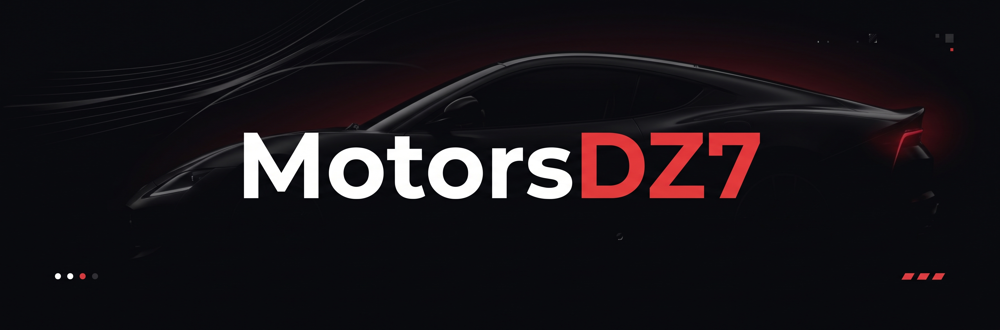

<p align="center">
  
</p>

# MotorsDZ7

Projeto desenvolvido para a atividade **Trabalho Individual React Router**.

A proposta foi criar uma aplicação web de uma empresa fictícia utilizando **React**, **React Router** e **Tailwind CSS**, com foco na criação de rotas, navegação entre páginas e organização de componentes.

## Sobre o projeto

A MotorsDZ7 é uma concessionária fictícia criada para o projeto.

A aplicação possui páginas para apresentação da empresa, veículos, serviços, informações institucionais e contato.

Também foi adicionada uma integração com uma API externa para realizar buscas de modelos de veículos Honda.

## Tecnologias utilizadas

- React
- TypeScript
- React Router
- Tailwind CSS
- Vite
- API vPIC

## Páginas do projeto

### Home

Página inicial da MotorsDZ7.

Contém:

- apresentação da empresa;
- banner principal;
- veículos em destaque;
- informações sobre a empresa;
- diferenciais;
- links para outras páginas.

### Carros

Página com veículos disponíveis.

Possui:

- Honda Civic;
- Toyota Corolla;
- Volkswagen Jetta;
- cards com informações dos veículos;
- links para detalhes;
- busca de modelos utilizando API.

### Detalhes do carro

Utiliza uma rota dinâmica:

```text
/carros/:id